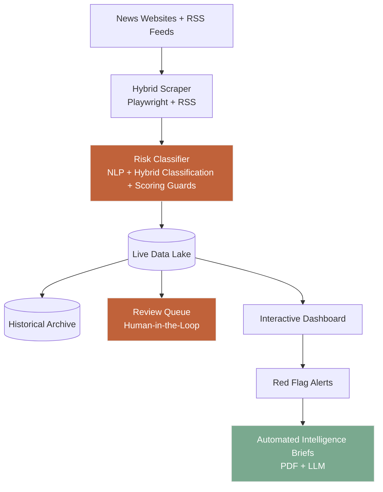
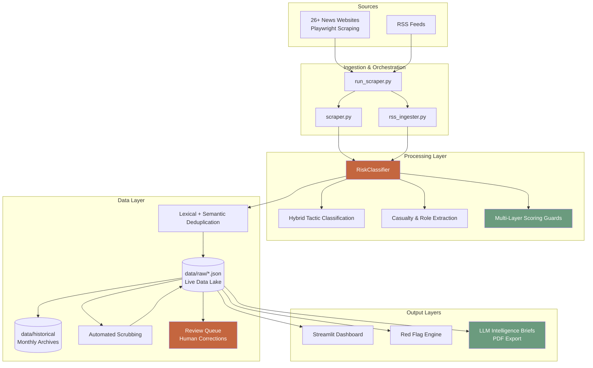

# 🛡️ India Conflict Corridor Tracker

**Real-Time Intelligence Pipeline for Jammu & Kashmir and Northeast India**

A hybrid intelligence monitoring system and tactical situational awareness dashboard that is designed to detect kinetic incidents, civil unrest, and security developments across Jammu & Kashmir and Northeast India. 

Built for operational monitoring and strategic analysis, this project serves as an autonomous, end-to-end intelligence pipeline that addresses the primary pitfalls of raw OSINT collection: **high-volume noise, source duplication, media echo chambers, and false positive inflation**.



## Why I Built This

As a senior intelligence analyst learning more about technical OSINT and AI-augmented analysis, I wanted to explore how automation and modern NLP/LLM tooling could meaningfully augment the intelligence cycle.

The goal was to build a system that handles the high-volume, repetitive parts of OSINT collection and initial triage, allowing analysts to focus on higher-order judgment, context, and deeper strategic thinking. I also wanted to make a practical, open tool available to the broader OSINT, security research, journalism, and academic community working on conflict dynamics in South Asia.

The India Conflict Corridor Intelligence Pipeline represents my first portfolio project exploring how automation can scale and streamline the intelligence analyst workflow. I hope that you find this project useful to your own research and it contributes towards a better understanding of the dynamics of (in)security and civil unrest in Jammu and Kashmir and Northeast India. 

## 📌 Architectural Overview

The platform features a hybrid ingestion architecture running parallel web scrapers, parses unstructured data through a localized Natural Language Processing (NLP) pipeline, and utilizes cross-district lexical deduplication to feed a real-time analytics dashboard and an open-source LLM-driven intelligence brief compiler.

India Conflict Corridor Tracker is an end-to-end intelligence pipeline that combines:
- **Automated data collection** from 26+ news sources using a hybrid Playwright + RSS architecture
- **Advanced NLP classification** with custom SpaCy NER, dependency-based role extraction, and a hybrid coarse-to-granular tactic classification system
- **Interactive operational dashboard** with geospatial heatmaps, threat actor analysis, and 24-hour tactical Red Flag alerting
- **Human-in-the-loop Review Queue** for analyst correction and data quality control
- **Automated intelligence reporting** powered by Groq (Llama 3.3), featuring dual regional heatmaps and verified incident logs

The system prioritizes **relevance and low noise**, making it suitable for security analysts, academic researchers, journalists and law enforcement professionals focused on South Asian conflict dynamics.

---

### ✨ Key Operational Features:

The India Conflict Corridor Tracker is designed to cut through OSINT noise and provide immediate, analyst-ready situational awareness across Jammu & Kashmir and Northeast India.

**Autonomous Multi-Source Collection** Continuous ingestion from 26+ regional news outlets and RSS feeds, ensuring analysts never miss a localized flashpoint or localized security development.

**Real-Time Situational Awareness** - An interactive command dashboard featuring district-level geographic heatmaps, temporal trendlines, and 24-hour tactical Red Flag alerts for rapidly escalating hotspots.

**Threat Actor Network Mapping** Dynamic visualisations including sankey operational link diagrams that visualize the complex relationships between Non-State Threat Actors, State Security Forces, deployed tactics, and targeted districts. 

**Granular Conflict Differentiation** Strict operational categorization that seamlessly separates High-Risk Kinetic operations (gunfights, IEDs, ambushes) from systemic Civil Unrest (economic blockades, mass protests, shutdowns). (BART for coarse tactic category + deterministic keywords for granular tactics).

**Human-in-the-Loop Review Queue**  
Articles flagged as uncertain can be reviewed by human analyst, reclassified, or marked as not relevant. Corrections are written directly back to the live data lake.

**Automated Intelligence Briefs** One-click, LLM-generated intelligence briefs that compile strategic narratives, verified incident logs, and dual-regional threat assessments into standardized, distributable PDFs.

---

#### 🔥 Key Engineering Guardrails

This pipeline incorporates several deliberate engineering decisions to maximize signal while minimising noise and analyst fatigue:

**1. Hybrid Tactic Classification with Defensive Overrides**  
The system uses a hybrid approach: BART for broad categorisation (Violent / Unrest / Routine) followed by precise keyword matching within the chosen category. Multiple circuit breakers — including civic and accident overrides — actively demote misclassified non-conflict content (such as road accidents, medical news, or administrative stories) before they can inflate risk scores.

**2. Multi-Layer Lexical and Semantic Deduplication**
To combat media echo chambers and syndicated reporting, the system applies deduplication at multiple stages using both word-overlap (Jaccard 50% overlap threshold) and sentence embeddings. This ensures that a single event reported across dozens of outlets is treated as one operational entity rather than multiple separate incidents.

**3. Multi-Layer Scoring Guards**  
Before any article receives an elevated risk score, it must pass several deterministic guardrails. These include detection of derivative aftermath framing, a concrete-evidence requirement for high-risk floors, recognition of legitimate counter-insurgency indicators, and spatial anchoring to ensure incidents are correctly attributed to the monitored region.

**4. Hierarchical Spatial Epicenter Anchoring**  
The dashboard uses a “Title Trump Card” + “Dateline Fallback” logic to correctly attribute incidents to the right district, even when articles contain boilerplate reporting language from regional bureaus.

**5. Split-Threshold Alerting + Lenient Age Filtering**  
- Kinetic events require a minimum risk score of **8.0**, while Civil Unrest events trigger at **7.5** to balance sensitivity with alert fatigue.
- The system uses **lenient article age filtering** — articles with unparseable dates are retained rather than discarded. This prevents breaking news from being lost due to HTML parsing issues.

**6. Dual-Layer Data Architecture with Human-in-the-Loop Review**  
The system maintains both a real-time operational data lake and a structured historical archive. A dedicated Review Queue allows analysts to correct uncertain classifications or flag irrelevant content, with changes written directly back to the live data lake. This ensures continuous quality improvement while preserving analyst oversight.

---

#### 🔥 Algorithmic Risk Scoring Matrix

The system uses a transparent, deterministic scoring model:

- **Baseline Score**: 8.0 for Kinetic operations and 7.5 for significant Civil Unrest (when justified by evidence).

- **Threat Actor Multiplier**: +2.0 when a verified actor, perpetrator, or claim of responsibility is extracted (capped at 10.0).

- **Noise Floor**: Articles lacking concrete evidence are capped at 4.0 or below.

- **Aftermath & Derivative Dampening**: Stories that are primarily reactions or administrative follow-ups have their scores capped.

---

## 🏗️ System Architecture



---

## 🛠️ Tech Stack

| Layer                    | Technology                                      |
|--------------------------|-------------------------------------------------|
| Web Scraping             | Playwright (Async) + Trafilatura                |
| RSS Ingestion            | feedparser + requests                           |
| NLP & Classification     | SpaCy + Custom EntityRuler + Hybrid BART/Regex  |
| Dashboard                | Streamlit + Plotly                              |
| Reporting                | Groq (Llama 3.3) + ReportLab                    |
| Data Processing          | Pandas                                          |
| Visualization            | Plotly (Mapbox, Sankey, Heatmaps)               |

---

## 🚀 Getting Started

### Prerequisites
- Python 3.10+
- Playwright browsers installed
- Groq API key (for intelligence brief generation)

### Installation

```bash
git clone https://github.com/sourcesofx/India-Conflict-Corridor-Tracker
cd India-Conflict-Corridor-Tracker

python -m venv venv
source venv/bin/activate          # On Windows: venv\Scripts\activate

pip install -r requirements.txt
playwright install
```

### Environment Variables

Create a `.env` file in the root directory:

```bash
GROQ_API_KEY=your_groq_api_key_here
```

## ▶️ Usage

**1. Run the Full Pipeline**

```bash
python run_scraper.py
```

This starts the hybrid scraper (Playwright + RSS), classifies articles, and saves results to `data/raw/`.

**2. Launch the Dashboard**

```bash
streamlit run src/dashboard.py
```

**3. Generate Weekly Intelligence Brief**

The weekly intelligence brief is fully integrated into the dashboard. To generate an AI-Intel Brief you can navigate to **Tab 5: Weekly Summary** and click **"Generate & Download PDF Report"**.

The system will automatically:

- Aggregate the last 7 days of high-value incidents
- Generate dual regional heatmaps (Jammu & Kashmir + Northeast India)
- Produce an LLM-powered strategic narrative
- Create verified Kinetic and Civil Unrest logs (Top 5 Incidents)
- Output a professional dark-mode PDF brief

## 📊 Dashboard Highlights

- Executive summary with key metrics
- Interactive geographic heatmap
- Non-State Threat Actors vs State Security Forces analysis
- Sankey operational link diagrams
- 24-hour Tactical Red Flag Alerts with lexical deduplication
- Searchable latest incidents table
- One-click generation of weekly intelligence briefs through the Dashboard UI

## 📄 Intelligence Brief Output

Generated briefs include:

- Executive Summary
- Situational Overview (with differentiation between Non-State and State actors)
- Key Developments & Trends
- Mitigation Strategies
- Verified Critical Kinetic Log (Top 5)
- Verified Civil Unrest Log (Top 5)
- Dual Regional Heatmaps (J&K + Northeast)

## ⚠️ Limitations & Notes

- The classifier is intentionally strict to prioritize relevance and reduce noise.
- LLM-generated narratives should be treated as analytical aids, not definitive intelligence.
- Geographic and threat actor coverage is limited to locations and organisations defined in `keywords.json`.
- Threat Actor Network Mapping occasionally provides some false positive results and mis-classification of tactics due to limitations of using open-source NLP models. An initial fix has been the introduction of a human-in-the-loop review queue to allow analysts to re-classify or delete edge case incidents.
- Further refinement could see the implementation of an LLM in the pipeline to parse operational details from article body text and output results in JSON format to populate the datalake.
- Some news sources may change structure or block scraping over time.

## ⚠️ Tactical System Disclaimers & Scope

- **Geographic Constraints:** Entity extraction boundaries are strictly governed by the semantic thresholds structured in `keywords.json`.
- **Analytical Intent:** LLM contextual generations function as advisory cognitive summaries. Tactical operational assessments should rely on the verified structural logs.
- **Upstream Resilience:** Scraping loops utilize defensive element lookups, but are subject to variance if primary newspaper DOM paths or security frameworks undergo major re-platforming.

## 🗺️ Future Roadmap

- Automated scheduling and email delivery of briefs
- Improved red flag clustering logic
- Historical trend analysis module
- Docker containerization
- Implementation of hybrid-architecture using open-source LLM to parse details from ingested article content
- Social Media Feed and scraping of X posts from verified journalists, researchers and OSINT analysts covering J&K and Northeast India

## 📜 License

This project is released under a Custom License with the following conditions:

- **Allowed:** Personal use, academic research, education, and non-commercial projects (with proper attribution).
- **Not Allowed:** Commercial use without express written permission from the developer.

For commercial licensing inquiries, please contact the author.

Full license text is available in the LICENSE file.
